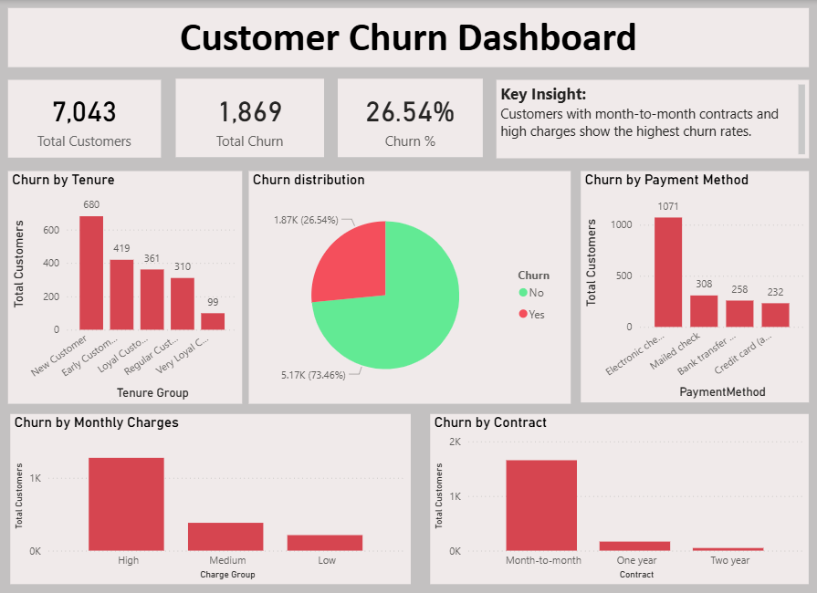

Customer Churn Analysis

## Overview
This project analyzes customer churn behavior using SQL and Power BI. The goal is to identify key factors that lead to customer attrition and provide actionable insights.

## Tools Used
- MySQL
- Power BI

## Dataset
The dataset contains customer information such as demographics, services, tenure, charges, and churn status.

## Key Insights
- Customers with month-to-month contracts show the highest churn.
- Higher monthly charges are associated with increased churn.
- Customers without tech support and online security are more likely to churn.
- New customers (low tenure) have higher churn rates.
- Electronic check users show higher churn compared to other payment methods.

## Dashboard

